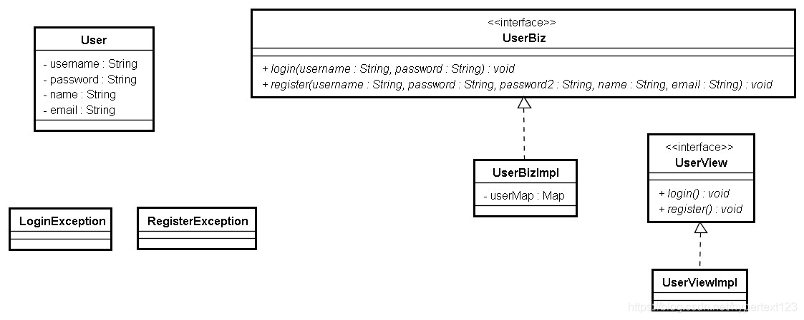
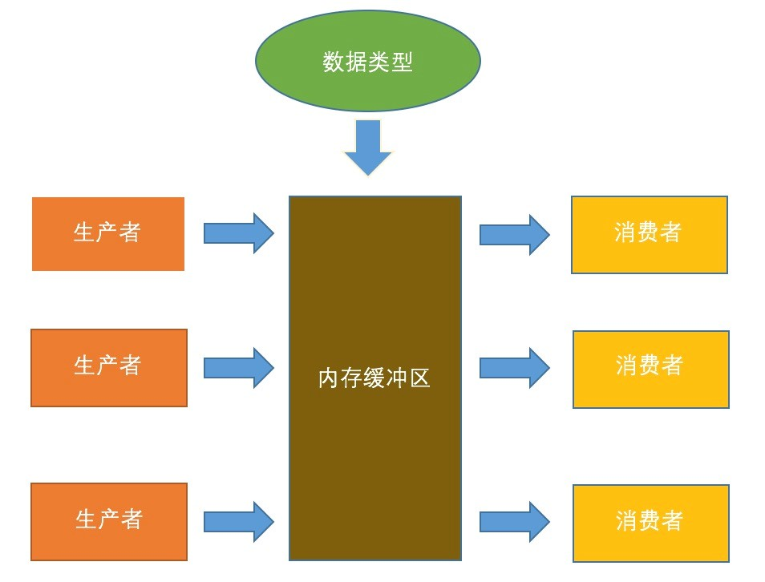

# HW5-1 - Exception & Multithread

## **001-异常捕获**

<details>

<summary>
题目
</summary>

### **题目描述**

编写一个程序，每0.01秒出现一次错误，捕获之（捕获100次），并显示到控制台上。

</details>

<details>

<summary>
代码
</summary>

```java
public class Q1_ExceptionCapture {
    public static void main(String[] args) {
        for (int i = 1; i <= 100; i++) {
            try {
                Thread.sleep(10);
                int ii = i / 0;
            } catch (ArithmeticException e) {
                System.out.print("Exception " + i + ": ");
                e.printStackTrace();
            } catch (InterruptedException e) {
                e.printStackTrace();
            }
        }
    }
}
```

</details>

## **002-自定义异常**

<details>

<summary>
题目
</summary>

### **题目描述**

完成某个计费系统的用户登录和注册模块，要求如下：

- 创建一个`User`类，包括：用户登录名（`username`）、密码（`password`）、用户真实姓名（`name`）、电子邮件地址（`email`）属性和相应的构造方法及`set/get`方法。
- 创建两个自定义异常类，一个`LoginException`，表示登录异常。一个`RegisterException`，表示注册异常。自定义的两个异常，都要求有一个接受字符串类型参数的构造方法。
- 创建一个UserBiz 接口，该接口中定义两个方法：
    ```
    void register(String username, String password, String password2, String name, String email) throws RegisterException //用户注册
    void login(String username, String password) throws LoginException //用户登录
    ```
    其中`register`方法接受两个`password`参数，原因是：在用户注册时，需要输入两遍`password`，只有两次输入的`password`一致，才允许注册。
- 创建`UserBiz`接口的实现类。其中
  - 为该实现类创建一个属性，该属性为一个`Map`，用来保存已注册的用户信息。`Map`的键为用户登录名，值为登录名对应的`User`对象。初始情况下，`Map`中保存的对象为以下两个：
    | 用户名| 密码| 真实姓名|电子邮件 |
    |:-:|:-:|:-:|:-:|
    |`admin`|`admin`|`Administrator`|`admin@123.com`|
    |`tom`|`cat`|`tomcat`|`tomcat@cat.com`|
  - `register`方法在以下两种情况下抛出异常：
    - u`sername`在`Map`中已存在
    - 两次输入的`password`不一致
  - `login`方法在以下两种情况下抛出异常：
    - `username`不存在
    - `username`和`password`不匹配
- 创建一个`UserView`接口，该接口中定义两个方法：
    ```
    void login();
    void register();
    ```
- 创建`UserView`接口的实现类。该实现类的`login`方法中，利用命令行，让用户输入用户名和密码，之后调用`UserBiz`中的`login`方法。部分代码示例如下：
    ```
    void login(){
        System.out.println(“请输入用户名：”);
        String username = ...;
        System.out.println(“请输入密码”);
        String password = ...;
        //调用UserBiz中的login方法
    }
    ```
    该类的`register`方法采用类似的方法，让用户输入注册时需要的信息，然后调用U`serBiz`中的`register`方法。
    注意：
    - 密码应该让用户输入两遍。
    - `UserViewImpl`中应当有一个`UserBiz`类型的属性
- 编写测试代码。

### **提示信息**

类图如下：



</details>

<details>

<summary>
代码
</summary>

```java
import java.util.HashMap;
import java.util.Map;
import java.util.Scanner;

// (7) Test
public class Q2_UserLogin {
    public static void main(String[] args) {
        UserViewImpl userViewImpl = new UserViewImpl();
        while (true) {
            System.out.println("Choose the option\n1. Login\n2. Register\nOthers. Quit");
            String key = userViewImpl.scanner.next();
            if (key.equals("1")) {
                userViewImpl.login();
            }
            else if (key.equals("2")) {
                userViewImpl.register();
            }
            else {
                break;
            }
        }
    }
}

// (1) User class, attributes, constructors and set/get methods
class User {
    // Attributes
    private String username;
    private String password;
    private String name;
    private String email;

    // Constructors
    public User(String username, String password, String name, String email) {
        this.username = username;
        this.password = password;
        this.name = name;
        this.email = email;
    }
    public User() {}

    // get/set methods
    public String getUsername() {
        return username;
    }
    public void setUsername(String username) {
        this.username = username;
    }
    public String getPassword() {
        return password;
    }
    public void setPassword(String password) {
        this.password = password;
    }
    public String getName() {
        return name;
    }
    public void setName(String name) {
        this.name = name;
    }
    public String getEmail() {
        return email;
    }
    public void setEmail(String email) {
        this.email = email;
    }
}

// (2.1) LoginException with constructor requiring a String param
class LoginException extends Exception{
    public LoginException(String s) {
        super(s);
    }
}

// (2.2) RegisterException with constructor requiring a String param
class RegisterException extends Exception{

    public RegisterException(String s) {
        super(s);
    }

}

// (3) UserBiz interface
interface UserBiz {
    // Register method
    void register(String username, String password, String password2, 
                  String name, String email) throws RegisterException;
    // Login method
    void login(String username, String password) throws LoginException;
}

// (4) Implement UserBiz
class UserBizImpl implements UserBiz {
    // A Map saving registered users
    Map<String, User> map = new HashMap<>();
    // Initialize map
    {
        map.put("admin", new User("admin", "admin", "Administrator", "admin@123.com"));
        map.put("tom", new User("tom", "cat", "tomcat", "tomcat@cat.com"));
    }
    public void register(String username, String password, String password2, 
                  String name, String email) throws RegisterException {
        
        if (map.get(username) == null) {
            
            if (password.equals(password2)) {
                map.put(username, new User(username, password, name, email));
                System.out.println("Register success!");
            }
            // Throws exception when 
            else {
                // (1) passwords do not match
                throw new RegisterException("Passwords Not Match!");
            }
        }
        else {
            // (2) username exists
            throw new RegisterException("Username Exists!");
        }
    }

    public void login(String username, String password) throws LoginException {
        if (map.get(username) != null) {
            if ((map.get(username).getPassword()).equals(password)) {
                System.out.println("Login success!");
            }
            // Throws exception when 
            else {
                // (1) passwords mismatch username
                throw new LoginException("Wrong Password!");
            }
        }else {
            // (2) user does not exist
            throw new LoginException("Username Not Exists!");
        }
    }
}

// (5) UserView interface
interface UserView {
    void login();
    void register();
}

// (6) Implement UserView
class UserViewImpl {
    Scanner scanner = new Scanner(System.in);
    UserBiz userBiz = new UserBizImpl();

    public void login() {
        // Input username and password
        System.out.println("Please input username: ");
        String username = scanner.next();
        System.out.println("Please input password: ");
        String password = scanner.next();
        // Call login() in UserBiz
        try {
            userBiz.login(username, password);
        } catch (LoginException e) {
            System.out.println(e.getMessage());
        }
    }

    public void register() {
        // Input necessary info
        System.out.println("Please input username: ");
        String username = scanner.next();
        System.out.println("Please input password: ");
        String password = scanner.next();
        System.out.println("Please input password again: ");
        String password2 = scanner.next();
        System.out.println("Please input name: ");
        String name = scanner.next();
        System.out.println("Please input email address: ");
        String email = scanner.next();
        // Call register() in UserBiz
        try {
            userBiz.register(username, password, password2, name, email);
        }catch (RegisterException e) {
            System.out.println(e.getMessage());
        }
    }
}
```

</details>

## **003-读取整数**

<details>

<summary>
题目
</summary>

### **题目描述**

接收5个整数，然后输出。如果输入数据不为整数，给出出错信息，给出哪个数不符合要求，提示“请输入整数”，如果输入数据不足5个，显示“请输入至少5个整数”

### **提示信息**

提示：捕获`Integer.parseInt()`产生的异常

</details>

<details>

<summary>
代码
</summary>

```java
import java.util.Scanner;

public class Q3_IntegerInput {
    public static void main(String[] args) {
        Scanner scanner = new Scanner(System.in);
        //输入5个整数
        System.out.println("请输入5个整数:");
        String numStr = scanner.nextLine();
        String[] arrStr = numStr.split("[ ]+");
        int[] arr = new int[5];
        int i = 0;
        try{
            if (arrStr.length < 5) {
                throw new NotEnoughIntegerException("");
            }
            for (i = 0; i < 5; i++) {
                arr[i] = Integer.parseInt(arrStr[i]);
            }
            for (int i1 : arr) {
                System.out.println(i1);
            }
        }catch (NumberFormatException  e){
            System.out.println("第" + (i+1) + "个输入：\"" + arrStr[i] +"\"不符合要求");
            System.out.println("请输入整数");
            e.printStackTrace();
        }catch (NotEnoughIntegerException e){
            System.out.println("请输入至少5个整数");
            e.printStackTrace();
        }
    }
}

class NotEnoughIntegerException extends Exception{
    public NotEnoughIntegerException(String s) {
        super(s);
    }
}
```

</details>

## **004-简单计算器**

<details>

<summary>
题目
</summary>

### **题目描述**

编写一个简单的计算器程序，能够计算两个变量进行四则运算的结果。在计算中及时捕获各种算术异常，保证在输入各种数字的时候程序能够正常运行。

</details>

<details>

<summary>
代码
</summary>

```java
import java.util.InputMismatchException;
import java.util.Scanner;

public class Q4_Calculator {
    static public void main(String args[]){
        Scanner scanner = new Scanner(System.in);
        // Get the first number
        System.out.println("Input the first integer: ");
        int i1 = getInt(scanner);

        // Get operation and judge whether it is legal
        System.out.println("Input the operation (+-*/): ");
        char op = getOp(scanner);

        // Get the second number
        System.out.println("Input the second integer: ");
        int i2 = getInt(scanner);

        // Calculate and output the result
        Calculate(i1, op, i2);
    }

    static boolean isLegalOp(char s) {
        switch (s) {
            case '+':
            case '-':
            case '*':
            case '/':
                return true;
            default:
                return false;
        }
    }

    static int getInt(Scanner scanner) {
        int i = 0;
        while(true) {
            try {
                i = scanner.nextInt();
                break;
            } catch (InputMismatchException e){
                System.out.println("Please input an integer");
                scanner.next();
            }
        }
        return i;
    }

    static char getOp(Scanner scanner) {
        char op = 0;
        while (true) {
            try {
                op = scanner.next().charAt(0);
                if (!isLegalOp(op)) {
                    throw new IllegalOperationException("");
                }
                break;
            } catch (IllegalOperationException e) {
                System.out.println("Please input one of +-*/");
            }
        }
        return op;
    }

    static void Calculate(int i1, char op, int i2) {
        try {
            switch (op) {
                case '+':
                    System.out.println(i1 + "+" + i2 + "=" + (i1+i2));
                    break;
                case '-':
                    System.out.println(i1 + "-" + i2 + "=" + (i1-i2));
                    break;
                case '*':
                    System.out.println(i1 + "*" + i2 + "=" + (i1*i2));
                    break;
                case '/':
                    System.out.println(i1 + "/" + i2 + "=" + (i1/i2));
                    break;
            }
        } catch (ArithmeticException e) {
            System.out.println("An error occured: " + e.getMessage());
        }
    }
}

class IllegalOperationException extends Exception {
    public IllegalOperationException(String s){
        super(s);
    }
}
```

</details>

## **005-字符串转数值**

<details>

<summary>
题目
</summary>

### **题目描述**

创建一个`NumberField`类，它接收字符串输入，把字符串转成相应的数值输出；若字符串不能表示一个数值型的值，它将返回一个默认值。该类应该是健壮的，不会因为输入值而导致程序崩溃。请完成这个类，并加以测试。


</details>

<details>

<summary>
代码
</summary>

```java
public class Q5_NumberField {
    public static void main(String[] args) {
        String legalStr = "123";
        String illegalStr = "abc";
        NumberField legalNumberField = new NumberField(legalStr);
        NumberField illegalNumberField = new NumberField(illegalStr);
        int i1 = legalNumberField.parseNum();
        int i2 = illegalNumberField.parseNum();
        System.out.println("Number Field convert " + legalStr +" to " + i1);
        System.out.println("Number Field convert " + illegalStr + " to " + i2);
    }
}

class NumberField {
    private int defaultValue = -1;
    private String inputStr;

    public NumberField(String inputStr){
        this.inputStr = inputStr;
    }
     
    public int parseNum(){
        try{
            return Integer.parseInt(inputStr);
        } catch (Exception e) {
            return defaultValue;
        }
         
    }
}
```

</details>

## **006-生产消费者模式**

<details>

<summary>
题目
</summary>

### **题目描述**

注意观察麦当劳的点餐流程，该过程大致是，消费者点完快餐之后立即付款，然后到一旁等待取餐，前一位付完款之后，下一位点餐，取餐者在旁边等待，有专门的一个服务员专责负责配餐。麦当劳的这种模型是一种典型的生产者-消费者模型。所谓生产者-消费者模型，就是在一个系统中，存在生产者和消费者两种角色，他们通过内存缓冲区进行通信，生产者生产消费者需要的资料，消费者把资料做成产品。

请编写一个程序，实现生产者-消费者模型。

### **提示信息**

生产消费者模式如下图。



</details>

<details>

<summary>
代码
</summary>

```java
import java.util.LinkedList;

public class Q6_ProducerConsumer {
    public static void main(String[] args) {
        Buffer buffer = new Buffer(5);

        int numProducers = 3;
        int numConsumers = 3;

        Thread[] producerThreads = new Thread[numProducers];
        Thread[] consumerThreads = new Thread[numConsumers];

        for (int i = 0; i < numProducers; i++) {
            producerThreads[i] = new Producer(buffer, "Prudocer" + (i+1));
            producerThreads[i].start();
        }

        for (int i = 0; i < numConsumers; i++) {
            consumerThreads[i] = new Consumer(buffer, "Consumer" + (i+1));
            consumerThreads[i].start();
        }
    }
}

class Buffer {
    // Use a linkedlist to represent the buffer
    private LinkedList<Integer> buffer = new LinkedList<>();
    // The capacity of the buffer
    private int capacity;
    private static int totalProduceItem = 0;
    private static int totalConsumeItem = 0;

    public Buffer(int capacity) {
        this.capacity = capacity;
    }

    public synchronized void produce(int item, String name) {
        // When buffer reaches compacity, stop producing
        while (buffer.size() == capacity) {
            try {
                wait();
            } catch (InterruptedException e) {
                Thread.currentThread().interrupt();
            }
        }
        
        // Produce an item and print info
        totalProduceItem++;
        buffer.add(totalProduceItem);
        System.out.println(name + " Produced: " + item + ", Total Produced: " + totalProduceItem
                                + ", Buffer Left: " + buffer.size());
        // Start comsuming
        notifyAll();
    }

    public synchronized void consume(int item, String name) {
        // When buffer has no elements, stop consuming
        while (buffer.isEmpty()) {
            try {
                wait();
            } catch (InterruptedException e) {
                Thread.currentThread().interrupt();
            }
        }
        
        // Comsume an item and print info
        buffer.remove();
        totalConsumeItem++;
        System.out.println(name + " Consumed: " + item + ", Total Comsumed: " + totalConsumeItem 
                                + ", Buffer Left: " + buffer.size());
        // Start producing
        notifyAll();
    }
}

class Producer extends Thread {
    private Buffer buffer;
    private String name;

    public Producer(Buffer buffer, String name) {
        this.buffer = buffer;
        this.name = name;
    }

    // Each producer produces 10 items
    public void run() {
        for (int i = 1; i <= 10; i++) {
            buffer.produce(i, name);
        }
    }
}

class Consumer extends Thread {
    private Buffer buffer;
    private String name;
 
    public Consumer(Buffer buffer, String name) {
        this.buffer = buffer;
        this.name = name;
    }

    // Each consumer consumes 10 items
    public void run() {
        for (int i = 1; i <= 10; i++) {
            buffer.consume(i, name);
        }
    }
}
```

</details>

## **007-模拟翻译**

<details>

<summary>
题目
</summary>

### **题目描述**


模拟翻译过程，主讲人随机说一句（段）英文，翻译马上翻译成中文，请编写程序模拟这个过程。
英文讲演内容：
```
Friendship 
Every one of us, rich or poor, should at least have one or two good friends. My friends will listen to me when I want to speak, will wipe my eyes when I cry, will take care of me when I am sick, and my friends will go together with me side by side through this journey of life. 
Let's pray together now that one day, all of us could find the person we want to find, and could enjoy a real beautiful friendship in our lives. Let's pray the flower of friendship be-tween our friends and us would always bloom brightly in our hearts
```

### **提示信息**

提示：创建两个线程（讲演人和翻译），其中一个输出一句（段），另外一个输出对应的中文（讲演的速度随机、翻译的速度随机）。输出格式例如（翻译的粒度随机）：
```
Every one of us, rich or poor, should at least have one or two good friends. 
我们每个人,不论富裕还是贫穷,至少应该有一个或两个好朋友。
My friends will listen to me when I want to speak, will wipe my eyes when I cry, will take care of me when I am sick, and my friends will go together with me side by side through this journey of life. 
如果我想说话,我的朋友就会听我说,当我哭泣, 要擦去我的眼睛，在我生病时会照顾我，在这人生旅程上我的朋友将与我一起肩并肩。
Let's pray together now that one day, all of us could find the person we want to find, and could enjoy a real beautiful friendship in our lives. 
让我们一起祈祷，有一天，我们都能找到我们想找的人，可以享受一段我们生命中真正美好的友谊。
Let's pray the flower of friendship between our friends and us would always bloom brightly in our hearts.
让我们一起祈祷，我们与朋友的友谊之花永远绽放在我们的心中
```

</details>

<details>

<summary>
代码
</summary>

```java
import java.util.Random;

public class Q7_Translation {
    public static void main(String[] args) {
        Speech speech = new Speech();

        // Create a thread for the speaker and a thread for the translator
        Thread speakerThread = new Speaker(speech);
        Thread translatorThread = new Translator(speech);

        speakerThread.start();
        translatorThread.start();
    }
}

class Speech {
    private boolean spoken = false;
    private Random random = new Random();

    public synchronized void speak(String text) {
        while (spoken) {
            try {
                wait(); // Wait for the translator to notify
            } catch (InterruptedException e) {
                Thread.currentThread().interrupt();
            }
        }
        // Random speaking speed
        try {
            Thread.sleep(random.nextInt(3000)); 
        } catch (InterruptedException e) {
            e.printStackTrace();
        }
        System.out.println("Speaker: " + text);
        spoken = true;
        notify(); // Notify the translator
    }

    public synchronized void translate(String text) {
        while (!spoken) {
            try {
                wait(); // Wait for the speaker to notify
            } catch (InterruptedException e) {
                Thread.currentThread().interrupt();
            }
        }
        // Random translating speed
        try {
            Thread.sleep(random.nextInt(3000)); 
        } catch (InterruptedException e) {
            e.printStackTrace();
        }
        System.out.println("Translator: " + text);
        spoken = false;
        notify(); // Notify the speaker
    }

}

class Speaker extends Thread {
    private Speech speech;
    private static String[] speeches = {
            "Every one of us, rich or poor, should at least have one or two good friends.",
            "My friends will listen to me when I want to speak, will wipe my eyes when I cry, will take care of me when I am sick, and my friends will go together with me side by side through this journey of life.",
            "Let's pray together now that one day, all of us could find the person we want to find, and could enjoy a real beautiful friendship in our lives.",
            "Let's pray the flower of friendship between our friends and us would always bloom brightly in our hearts."
        };

    public Speaker(Speech speech) {
        this.speech = speech;
    }

    public void run() {
        for (String speechText: speeches) {
            speech.speak(speechText);
        }
    }
}

class Translator extends Thread {
    private Speech speech;
    private static String[] speeches = {
            "我们每个人,不论富裕还是贫穷,至少应该有一个或两个好朋友。",
            "如果我想说话,我的朋友就会听我说,当我哭泣, 要擦去我的眼睛，在我生病时会照顾我，在这人生旅程上我的朋友将与我一起肩并肩。",
            "让我们一起祈祷，有一天，我们都能找到我们想找的人，可以享受一段我们生命中真正美好的友谊。",
            "让我们一起祈祷，我们与朋友的友谊之花永远绽放在我们的心中"
        };

    public Translator(Speech speech) {
        this.speech = speech;
    }

    public void run() {
        for (String translationText: speeches) {
            speech.translate(translationText);
        }
    }
}
```

</details>

## **008-线程执行顺序**

<details>

<summary>
题目
</summary>

### **题目描述**

现在有T1、T2、T3三个线程，要求T2在T1执行完后执行，T3在T2执行完后执行，请用程序实现。

</details>

<details>

<summary>
代码
</summary>

```java
public class Q8_ThreadOrder {
    public static void main(String[] args){
        Thread T1 = new MyThread("Thread 1");
        Thread T2 = new MyThread("Thread 2");
        Thread T3 = new MyThread("Thread 3");

        try {
            T1.start();
            T1.join();
            T2.start();
            T2.join();
            T3.start();
            T3.join();
        } catch (InterruptedException e) {
            Thread.currentThread().interrupt();
        }
    }
}

class MyThread extends Thread {
    String name;
    public MyThread(String name) {
        this.name = name;
    }

    public void run() {
        for (int i = 0; i < 3; i++) {
            System.out.println(name + ": " + i);
            try {
                Thread.sleep(200);
            } catch (InterruptedException e) {
                Thread.currentThread().interrupt();
            }
        }
    }
}
```

</details>

## **009-独木桥**

<details>

<summary>
题目
</summary>

### **题目描述**

有一群小羊，身上长着白毛，头上有两只小角，叫起来“咩咩咩”的，大家叫他们小白羊。还有一群小羊，身上长着黑毛，头上有两只小角，叫起来“咩咩咩”的，大家叫他们小黑羊。小白羊和小黑羊都住在河边，小白羊住在小河东边，小黑羊住在小河西边，他们隔着一条河呢。这条河不宽，可是很深，哗啦啦，哗啦啦，河水一天到晚流着，这可怎么过桥呀？  还好，河上架着一根木头，这就叫做独木桥。

设有20只小白羊，有15只小黑羊，请编程模拟以下过河的情况：
- 在没有限制的情况下，白羊和黑羊过河，显示出每只羊的过河情况（如显示谁在过桥及其走向等）
- 独木桥很窄很窄，每次只能走一只羊，显示出每只羊的过河情况（如显示谁在过桥及其走向等）
- 独木桥上每次只能有两只羊，但这两只羊那必须是对向的，显示出每只羊的过河情况（如显示谁在过桥及其走向等）

</details>

<details>

<summary>
代码
</summary>

```java
import java.util.ArrayList;

public class Q9_CrossingRiver {
    public static void main(String[] args) {
        Test testThread1 = new Test(1);
        Test testThread2 = new Test(2);
        Test testThread3 = new Test(3);
        try {
            testThread1.start();
            testThread1.join();
            testThread2.start();
            testThread2.join();
            testThread3.start();
            testThread3.join();
        } catch (InterruptedException e) {
            Thread.currentThread().interrupt();
        }
    }
}

class Test extends Thread {
    private int testcase;
    private ArrayList<Sheep> whiteSheepThreads = new ArrayList<>();
    private ArrayList<Sheep> blackSheepThreads = new ArrayList<>();

    public Test(int testcase) {
        this.testcase = testcase;
    }

    public void run() {
        System.out.println("Testcase " + testcase + " start to run!");
        Sheep.bridge.init();
        // 20 white sheep
        for (int i = 1; i <= 20; i++) {
            Sheep whiteSheep = new Sheep(i, "white", testcase);
            whiteSheep.start();
            whiteSheepThreads.add(whiteSheep);
        }
        // 15 black sheep
        for (int i = 1; i <= 15; i++) {
            Sheep blackSheep = new Sheep(i, "black", testcase);
            blackSheep.start();
            blackSheepThreads.add(blackSheep);
        }
        // Seperate testcases
        for (Sheep whiteSheep: whiteSheepThreads) {
            try {
                whiteSheep.join();
            }  catch (InterruptedException e) {
                Thread.currentThread().interrupt();
            }
        }
        for (Sheep blackSheep: blackSheepThreads) {
            try {
                blackSheep.join();
            }  catch (InterruptedException e) {
                Thread.currentThread().interrupt();
            }
        }
    }
}

class Sheep extends Thread{
    private int index;
    private String color;
    private int testcase;
    static public Bridge bridge = new Bridge();

    public Sheep (int index, String color, int testcase) {
        this.index = index;
        this.color = color;
        this.testcase = testcase;
    }

    public void run() {
        if (testcase == 1) {
            bridge.crossingBridge1(color, index);
        }
        else if (testcase == 2) {
            bridge.crossingBridge2(color, index);
        }
        else if (testcase == 3) {
            bridge.crossingBridge3(color, index);
        }
    }
}

class Bridge {
    static private boolean whiteOnBridge = false;
    static private boolean blackOnBridge = false;
    static private int whiteTime = 0;
    static private int blackTime = 0;
    static private int time = 0;

    public boolean getState(String color) {
        if (color.equals("white")) {
            return whiteOnBridge;
        }
        if (color.equals("black")) {
            return blackOnBridge;
        }
        return false;
    }

    private String getDirection(String color) {
        if (color.equals("black")) {
            return "from west to east.";
        }
        if (color.equals("white")) {
            return "from east to west.";
        }
        return "";
    }

    public void init() {
        whiteOnBridge = false;
        blackOnBridge = false;
        whiteTime = 0;
        blackTime = 0;
        time = 0;
    }

    // Case 1: No constraints
    public void crossingBridge1(String color, int index) {
        System.out.println("At time " + time + ", " + color + " sheep " + index + " cross the river " + getDirection(color)); 
    }
    // Case 2: One sheep per second
    synchronized public void crossingBridge2(String color, int index) {
        System.out.println("At time " + time + ", " + color + " sheep " + index + " cross the river " + getDirection(color)); 
        time++;
    }
    // Case 3: At most one white and black sheep per second
    // Seperate black and white threads
    public void crossingBridge3(String color, int index) {
        if (color.equals("white")) {
            whiteCrossingBridge3(index);
            whiteTime++;
        }
        else if (color.equals("black")) {
            blackCrossingBridge3(index);
            blackTime++;
        }
    }

    synchronized private void whiteCrossingBridge3(int index) {
        String color = "white";
        System.out.println("At time " + whiteTime + ", " + color + " sheep " + index + " cross the river " + getDirection(color)); 
    }

    synchronized private void blackCrossingBridge3(int index) {
        String color = "black";
        System.out.println("At time " + blackTime + ", " + color + " sheep " + index + " cross the river " + getDirection(color)); 
    }
}
```

</details>

## **010-售票模拟**

<details>

<summary>
题目
</summary>

### **题目描述**

一影院有三个售票窗口，假设每个顾客每次只能买一张票，影院座位随机分配，请用多线程模拟售票过程，并分别统计每个售票窗口售票的数量及其出售的座位号。


</details>

<details>

<summary>
代码
</summary>

```java
import java.util.ArrayList;
import java.util.Collections;

public class Q10_TicketSelling {
    public static void main(String[] args) {
        TicketCounter.init();
        TicketCounter counter1 = new TicketCounter(1);
        TicketCounter counter2 = new TicketCounter(2);
        TicketCounter counter3 = new TicketCounter(3);
        try {
            counter1.start();
            counter2.start();
            counter3.start();
            counter1.join();
            counter2.join();
            counter3.join();
        } catch (InterruptedException e) {
            Thread.currentThread().interrupt();
        }
        counter1.printTotalInfo();
        counter2.printTotalInfo();
        counter3.printTotalInfo();
    }
}

class TicketCounter extends Thread {
    private static int tickets = 100;
    private static ArrayList<Integer> seats = new ArrayList<>();
    private int ticketsSold = 0;
    private int index;

    public static void init(){
        for (int i = 1; i <= tickets; i++) {
            seats.add(i);
        }
        Collections.shuffle(seats);
    }

    public TicketCounter(int index) {
        this.index = index;
    }

    public void run() {
        while (true) {
            if (tickets > 0) {
                sellTicket();
            }
            else {
                break;
            }
        }
    }

    private synchronized void sellTicket() {
        if (tickets > 0) {               
            tickets--;
            ticketsSold++;
            int seat = seats.remove(0);
            System.out.println("Counter " + index + " sells one ticket, seat is " + seat);
        }
    }

    public void printTotalInfo() {
        System.out.println("Counter " + index + " sells " + ticketsSold + " tiekcts in total");
    }
}
```

</details>
